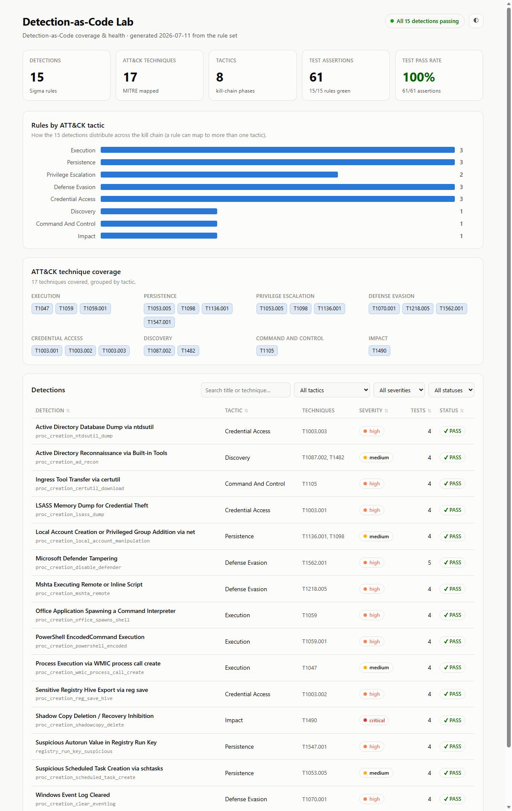
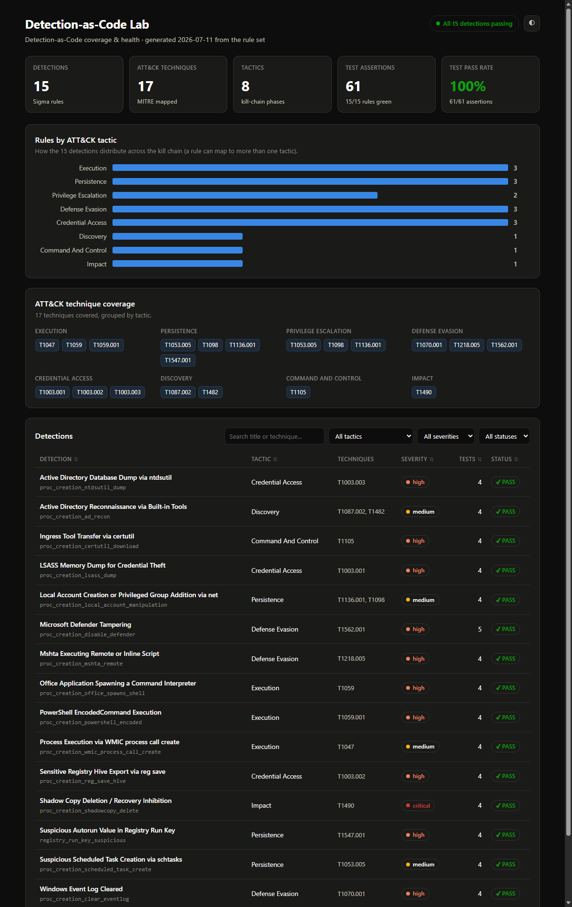
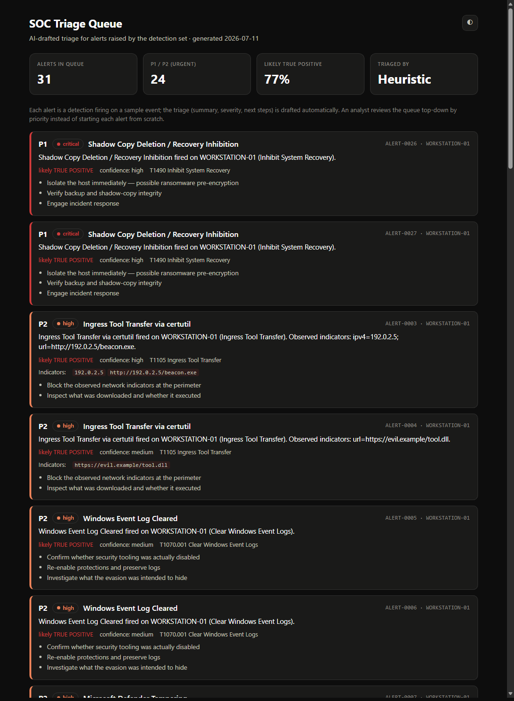
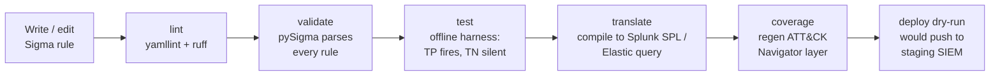

# Detection-as-Code Lab

**A working detection-as-code pipeline: 15 [Sigma](https://sigmahq.io) rules mapped to MITRE ATT&CK, unit-tested offline in pure Python, validated with real pySigma, and shipped through a GitHub Actions CI/CD pipeline that fails the build when a detection breaks.**


> Detection rules are code. They deserve version control, code review, automated
> tests, and CI/CD — the same as any other software. In most SOCs they get none
> of that: analysts edit rules live in a SIEM console with no test and no
> rollback. This repo is a small, complete demonstration of doing it properly.

---

## Why this project exists

In a 2025 survey, **63% of security professionals said they want to use detection-as-code, but only 35% actually do** — it's in demand and not yet commoditized. This project is my end-to-end take on the workflow: write a detection, prove it fires on the attack and stays quiet on benign activity, and gate it in CI so a regression can't merge.

Two things make it more than a folder of YAML:

1. **Every detection ships with tests.** A rule cannot merge without a companion case file containing at least one *true-positive* event (the attack) and one *true-negative* event (benign look-alike). CI enforces it.
2. **The tests run with no SIEM.** I wrote a small [Sigma evaluation engine](dac/matcher.py) that matches rules against individual JSON events in pure Python, so the whole suite runs in **~0.2 seconds** on every push — the offline analogue of firing an [Atomic Red Team](https://github.com/redcanaryco/atomic-red-team) test and checking the alert.

## Coverage & health dashboard

A single self-contained HTML page — generated from the rules and their **live test
results** — gives an at-a-glance view of the detection set: KPI tiles, a
rules-by-tactic breakdown, ATT&CK technique coverage, and a filterable/sortable
table where any regressed rule turns red. No backend, no external requests; it
opens straight from disk and is theme-aware.



<details><summary>Dark mode</summary>



</details>

```bash
make dashboard   # regenerates docs/dashboard.html; open it in any browser
```

Because it embeds test results computed at generation time, it's a health monitor,
not just a catalog — a detection that stops firing shows up as a failing row.

## LLM-assisted alert triage

An AI layer on top of the detections. When a detection fires, it becomes an
**alert**; the [`triage/`](triage/) package enriches it (pulls out IOCs, attaches
ATT&CK context) and drafts the tier-1 triage an analyst would otherwise write from
scratch — a summary, a severity call, a true/false-positive judgement, and
concrete next steps — rendered as a prioritized SOC queue.



Three things make this more than "call an LLM on a log line":

1. **Provider-agnostic by design.** Triage sits behind one interface
   (`triage(alert) -> TriageResult`). This project's LLM backend is **[Groq](https://groq.com)**
   (open models like Llama behind an OpenAI-compatible API), but switching
   providers is a one-class change — nothing else in the package moves.
2. **Alert data is treated as untrusted (OWASP LLM01).** Command lines and
   filenames in an alert are attacker-controlled and may be crafted to look like
   instructions. The event is fenced in an `<alert_data>` block and the model is
   told to treat everything inside as *data, never instructions* — prompt-injection
   defense built in.
3. **It ships with an evaluation.** [`triage.evaluate`](triage/evaluate.py) scores
   the triage against the detections' own severities (agreement, escalations,
   severity-step delta), so "is the LLM's judgement any good?" is a number, not a
   vibe.

The whole layer runs **offline with no API key** via a deterministic
`HeuristicTriageClient` — which is what CI and the tests use — so it's fully
reproducible; point it at Groq only when you want the real model. Details:
**[triage/README.md](triage/README.md)**.

```bash
python -m triage.cli run --offline -v        # triage the queue, no key needed
export GROQ_API_KEY=gsk_...                   # then use the real model:
python -m triage.cli run
```

## Pipeline



Each stage is a job in [`.github/workflows/detections-ci.yml`](.github/workflows/detections-ci.yml) and has a local equivalent in the [`Makefile`](Makefile).

## What's in the box

| Path | What it is |
|------|------------|
| [`detections/`](detections/) | 15 Sigma rules, organised by ATT&CK tactic |
| [`tests/cases/`](tests/cases/) | Per-rule true-positive / true-negative sample events |
| [`dac/`](dac/) | The offline Sigma evaluation engine (matcher + condition parser) |
| [`triage/`](triage/) | LLM-assisted alert triage (enrichment + Groq/offline clients + evaluation) |
| [`tests/`](tests/) | pytest harness — behavioural + governance + engine unit tests |
| [`tools/`](tools/) | pySigma validator, ATT&CK layer / dashboard / catalog generators |
| [`.github/workflows/`](.github/workflows/) | The CI/CD pipeline |
| [`lab/`](lab/) | How to reproduce the detections live (Wazuh + Sysmon + Atomic Red Team) |
| [`docs/`](docs/) | Architecture, generated detection catalog, write-up |

## Coverage

15 detections across 8 ATT&CK tactics and 17 techniques. Full generated catalog: **[docs/DETECTIONS.md](docs/DETECTIONS.md)**.

| Tactic | Techniques |
|--------|-----------|
| Execution | T1059, T1059.001, T1047 |
| Persistence / Priv-Esc | T1547.001, T1053.005, T1136.001, T1098 |
| Defense Evasion | T1070.001, T1218.005, T1562.001 |
| Credential Access | T1003.001, T1003.002, T1003.003 |
| Discovery | T1087.002, T1482 |
| Command & Control | T1105 |
| Impact | T1490 |

The heatmap in [`docs/attack-layer.json`](docs/attack-layer.json) renders in the [ATT&CK Navigator](https://mitre-attack.github.io/attack-navigator/) (Open Existing Layer → Upload from local).

## Quickstart

```bash
git clone <this-repo> && cd detection-as-code-lab
python -m pip install -r requirements-dev.txt

make test        # run the offline detection harness (no SIEM needed)
make validate    # parse every rule with real pySigma
make coverage    # print ATT&CK tactic/technique coverage
make translate   # compile the rules to Splunk SPL
```

Expected `make test`:

```
151 passed in 0.22s
```

## How the offline test harness works

A test case declares the events a rule must catch and the events it must ignore:

```yaml
# tests/cases/proc_creation_lsass_dump.yml
rule: credential_access/proc_creation_lsass_dump.yml
true_positives:
  - name: procdump full dump of lsass
    event:
      EventID: 1
      Image: 'C:\Tools\procdump.exe'
      CommandLine: 'procdump.exe -accepteula -ma lsass.exe C:\temp\lsass.dmp'
true_negatives:
  - name: procdump against a benign process
    event:
      EventID: 1
      Image: 'C:\Tools\procdump.exe'
      CommandLine: 'procdump.exe -accepteula -ma notepad.exe C:\temp\np.dmp'
```

The [engine](dac/matcher.py) compiles the rule's `detection` block — field modifiers
(`contains`, `endswith`, `re`, `all`, …), Sigma wildcards, and the boolean
`condition` grammar (`1 of selection_*`, `all of them`, `and/or/not`) — into
predicates and evaluates them against each event. pytest turns every sample into
its own test:

```
tests/test_detections.py::test_true_positive_fires[proc_creation_lsass_dump::TP::procdump full dump of lsass] PASSED
tests/test_detections.py::test_true_negative_is_silent[proc_creation_lsass_dump::TN::procdump against a benign process] PASSED
```

**The engine is a documented subset of Sigma** (see [docs/architecture.md](docs/architecture.md)); every rule is written to stay inside it, and the CI `validate` stage cross-checks each rule with the full pySigma library so the offline results agree with what a real backend would run. Unsupported syntax raises rather than silently mis-evaluating.

### Proof the gate works

Broadening the certutil rule so it fires on *any* certutil invocation immediately breaks the build:

```
FAILED tests/test_detections.py::test_true_negative_is_silent[proc_creation_certutil_download::TN::certutil hashing a local file is benign]
  AssertionError: rule 'proc_creation_certutil_download' FALSE-POSITIVED on benign event
  'certutil hashing a local file is benign'. The rule is too broad — tighten it or add a filter.
```

## Reproducing detections live

The offline harness proves the *logic*; the [lab guide](lab/README.md) shows how to
prove it on real telemetry: a Windows VM with **Sysmon** shipping to a **Wazuh**
SIEM, driven by **Atomic Red Team** tests. Each rule references the specific
atomic test that exercises it, so you can run the attack and watch the alert fire.

## What I'd build next

- **base64 / obfuscation modifiers** in the engine to cover encoded PowerShell payloads at the token level, not just the `-enc` flag.
- **Correlation rules** (Sigma's `correlation` type) for multi-event detections like discovery bursts, which single-event rules under-serve.
- **A labelled triage dataset** so the [LLM triage layer](triage/) can be evaluated against human decisions, not just the detections' own severities.
- **Linux coverage** (auditd / Sysmon-for-Linux) alongside the Windows rules.

## Skills this demonstrates

Detection engineering · Sigma & MITRE ATT&CK · detection-as-code / CI-CD · Python
(parser + evaluation engine, no framework) · test design (true/false-positive
modelling, governance tests) · GitHub Actions · SIEM query translation (Splunk /
Elastic) · **LLM integration (Groq) with prompt-injection defense (OWASP LLM01)
and a measured evaluation** · technical writing.

## License

MIT — see [LICENSE](LICENSE).
